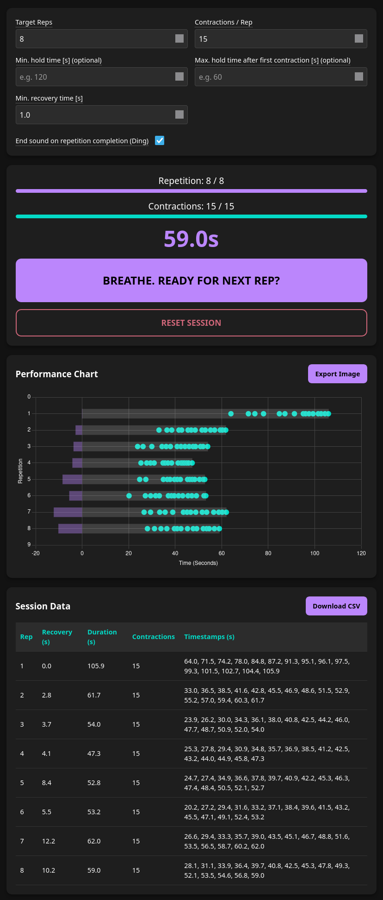

# Wonka Table Tracker

Increase your CO2 tolerance and thereby your breath-hold time efficiently and safely.
Instead of purely relying on the clock (as CO2 tables usually do), Wonka tables focus on your body's feedback - diaphram contractions.
[Learn more about wonka tables on here.](https://getstamina.app/blog/wonka-tables)

This website tracks one of your Wonka table sessions, logging how long each breath hold was, how long your recovery time between breath hold repetitions is, and when exactly the contractions occurred for each repetition.
(Tracking in the "keep track of" sense, not the way that is sadly popular on the internet nowadays. No data is sent to anyone.)
It allows you to configure several parameters.

Here is my first session:

I'm sure you can do better. ;)

---

I have vibe-coded this tool for myself (using Gemini 3) since the stamina app locks wonka tables behind a paywall.
Any improvement suggestions and bug reports are welcome.
